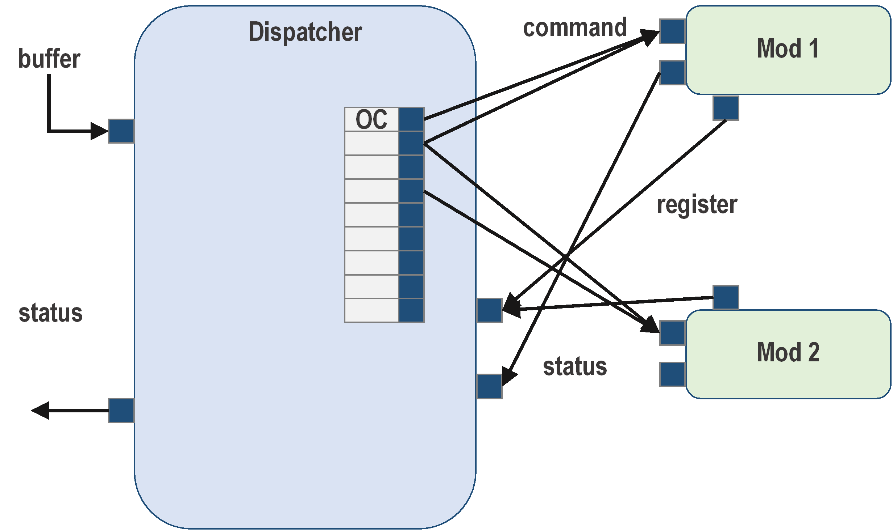
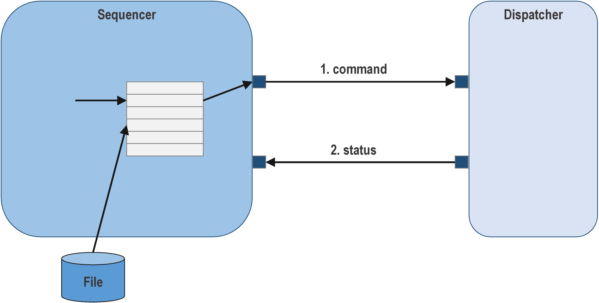
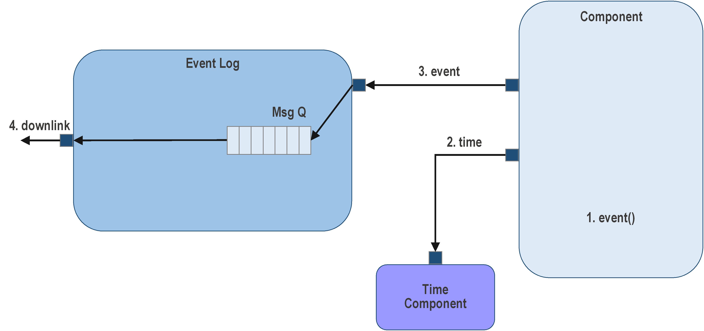
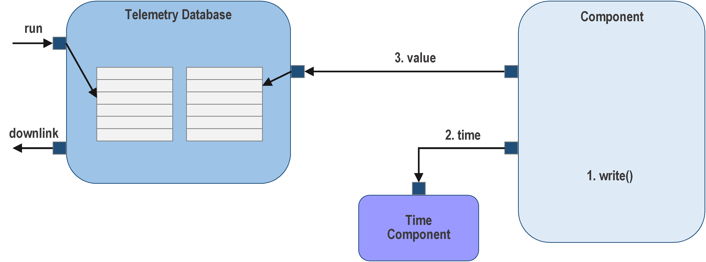
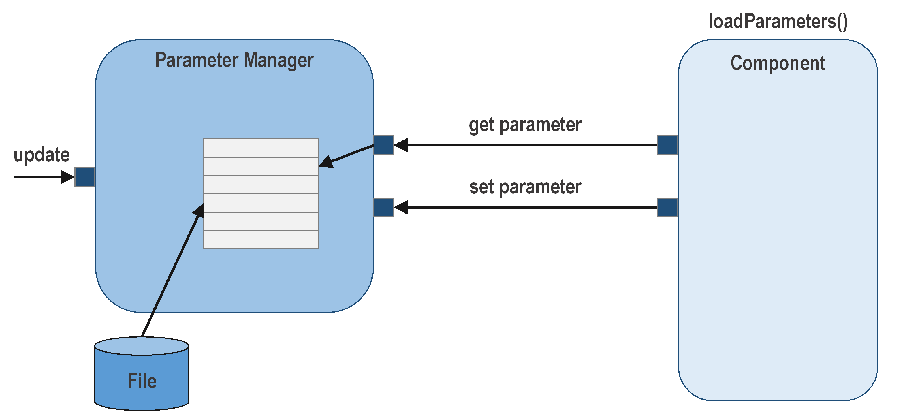

# Data Constructs: Commands, Events, Channels, and Parameters

Typically, spacecraft software is controlled through commands and monitored using a set of events and telemetry
channels. These are the critical data constructs supported directly by F´ and have built-in autocoder support. In
addition, the F´ `Svc` components handle these types making it easy to define and control an F´ system through commands,
events, and telemetry channels.

Parameters allow for controlling stored values that affect the operation of an F´ system. They have framework support
to automatically, load, store, and set these values using commands.

!!! note
    Events are sometimes called EVRs and telemetry channels are sometimes called EHAs.

These types will be elaborated within this guide. It contains:

- [Commands](#commands)
    - [Command Dispatching](#command-dispatching)
    - [Command Sequencing](#command-sequencing)
- [Events](#events)
    - [Event Logging](#event-logging)
- [Channels](#channels)
    - [Telemetry Database](#telemetry-database)
- [Parameters](#parameters)
- [A Note On Serialized Ports](#a-note-on-serialized-ports)

## Commands

Each **Component** defines a set of commands for operations. Unlike ports, which are intended for component to component communication, commands are designed for user interaction with a component. Commands are defined through a series of
properties. Users can send commands to the F´ system and via `Svc::CmdDispatcher` these commands are dispatched to a
handling component to invoke some behavior. The handling component handles a command by defining a command handler function
to run when the command arrives.

The properties defining commands are shown below:

1. opcode: a numerical value uniquely representing the command. This opcode is automatically adjusted to be relative to
a component's base id, and thus will not collide with other commands defined by other components.
2. mnemonic: a text value uniquely representing the command. The component instance name is prepended to the mnemonic
to ensure uniqueness in the system.
3. arguments: a set of primitive and F´ data types supplied to the command handler to adjust its execution. These
arguments are sent from the ground.
4. synchronization "kind": (sync, async, guarded) controls which execution context the command runs in. Sync and guarded
commands run on the execution context of the command dispatcher. Async commands execute on the component threads and
can specify a priority. Guarded commands are protected from reentrancy by a mutex. These are similar to
[port kinds](port-comp-top.md#a-quick-look-at-port-kinds-defined-in-a-components-usage)

Code in the component-specific generated base class calls a function to invoke the user-defined command handler. This is
hooked up by connecting the command registration, command dispatch, and command response ports.

### Command Dispatching

When commands are defined for a component, the autocoder automatically adds ports for registering and receiving
commands, and reporting an execution status when finished. Each component that handles commands should be hooked up to
the command dispatcher connecting the registration, dispatch, and response ports in parallel.

**Figure 4. Command dispatcher.** The command dispatcher receives the raw buffer containing the command and arguments.
The command opcode is extracted, and a lookup table is used to find the handling component. The argument buffer is then
passed to the component, and the command dispatcher waits without blocking for the component to return status..

In many projects, commands need to be sequenced in order. In order to facilitate this, the framework provides 
`Svc::CmdSequencer`. The command sequencer reads a defined sequence of commands and sends each in turn to the command 
dispatcher; after each command is dispatched, the status of its execution is returned to the sequencer. Sending command buffers 
to the command dispatcher through the command sequencer is an alternate path to sending them externally from the ground.

### Command Sequencing

**Figure 5. Command sequence.** The command sequencer loads a sequence file from the file system, sends the command,
 and waits for the response for each command in the sequence. A failed response terminates the sequence,
while a successful response moves to the next command in the sequence.

## Events

Events represent a log of activities taken by the embedded system. Events can be thought of in the same way as a program
execution log in that they enable the ability to trace the execution of the system. Events are sent out of the system via 
the `Svc::ActiveLogger` component and components defining events should hook up the log port to it. If console logging is
desired, the text log port can be hooked up to the `Svc::PassiveConsoleTextLogger` component. Events are defined per
component and are typically used to capture what the component is doing. Events can occur sporadically; however, they 
should all be captured for downlink. Events are defined by the following properties:

1. id: a numeric id uniquely define this event. It is automatically offset by the component's base id to ensure global
uniqueness.
2. name: a unique text identifier for this event. This is prepended by the component instance name to remain unique.
3. severity: a text identifier identifying the severity of this event. Possible values are:
    1. DIAGNOSTIC: akin to debug messages.  Usually not sent to the ground.
    2. ACTIVITY_LO: akin to fine info messages these typically come from background tasks
    3. ACTIVITY_HI: akin to info messages these typically come from foreground tasks
    4. WARNING_LO: less severe warning events
    5. WARNING_HI: high-severity warning events, although the system can still function
    6. FATAL: fatal events indicating that the system **must** reboot
    7. COMMAND: events tracing the execution of commands
4. arguments: like command arguments, these are primitive and complex types that represent the variable data associated
with the event. These are injected into the format string for a full text representation of the event.
5. format string: a C-style format string used to reconstruct a text version of the event.

!!! note
    the use of events to severity levels are based on the judgement of the system designer.

Code in the component-specific generated base class provides a function to call to emit each event defined by the
component. This function expects an argument to be supplied for each argument defined by the event. The code generator
automatically adds ports for retrieving a time tag and sending events. There are two independent ports for sending
events:

1. binary log output port for sending outside the system
2. a text log output port for on-board consoles

### Event Logging

Events first acquire a time tag to represent when they occurred and then are typically sent to the `Svc::ActiveLogger`
component on their way to be sent down to the ground. This logger component both processes the event and also recognizes
and begins responses for FATAL severity events.

**Figure 6. Event log.** The component implementation calls a function to generate the event. The base class retrieves the
time tag from the time source component. The component sends the event to the event log component, which reads it from
the port queue and sends it to the ground.

## Channels

Channels, also known as Telemetry Channels, or just Telemetry, represent the current reading of some portion of the system
state. This state is either restricted to "send on change" or "send per update" even if the update is already the
current value. Channels are broken up per component and are typically sampled at a set rate and downlinked. Channels are
id, time, and value triples and are defined per component with the following properties:

1. id: the unique id of the channel. This is offset by the base id of the component for global uniqueness.
2. name: the unique text name of the channel. This is prepended with the component instance name for global uniqueness.
3. data_type: type of the value of the channel. Can be primitive and complex types.
4. update: "on_change" to update only when the written value changes, and omitted to always downlink

Code in the component-specific generated base class provides a function to call to set the current value for a
channel id. This function must be supplied with a typed argument for the value. It will request the time tag internally.
The code generator automatically adds ports for retrieving time tags and sending channelized data.

### Telemetry Database

The telemetry database acts as a double-buffered store for telemetry values. Components are free to update channels at
any time; however, the current value will be read from the telemetry database and sent to the ground at a set rate.
Components using this service should hook up the telemetry port to the telemetry database (`Svc::TlmChan`).

**Figure 7. Telemetry database.** The telemetry database has a double-buffered array of telemetry buffers. The base
class function retrieves the time tag from the time source component and then writes the updated value to the telemetry
database component. The telemetry database is called periodically to send the current set of telemetry to the ground.

!!! note
    the periodic call to the telemetry database is typically made by a [rate group](../design/rate-group.md).

## Parameters

Parameters are traditional means of storing non-volatile states in the embedded system. The framework provides code
generation to manage parameters defined by a component. Parameters are defined by the following properties:

1. id: unique id of the parameter, offset by component base id to ensure global uniqueness
2. name: unique text name of parameter prepended by component instance name for global uniqueness.
3. data type: primitive or complex types that represent the type of the value stored.
4. default value: default values are assigned in the event the parameter cannot be retrieved.

The code generator automatically adds ports for retrieving parameters. During initialization, a public method in the
class is called which retrieves the parameters and stores copies locally. Calls can reoccur if the parameter is updated.
The code-generated base class provides a function to call for each parameter to retrieve the stored copy; and an
implementation class can retrieve the value whenever the parameter value is needed.

### Parameter Database

The framework provides the ability to store these parameters in the parameter database (`Svc::PrmDb`). This component
provides ports to get and set parameters, which are stored in a file to persist across reboots.

**Figure 8. Parameter manager.** The parameter manager or database loads the file containing parameters from the file
system during initialization. The initialization subsequently calls *loadParameters()* on components with parameters.
Components can set and retrieve parameters. The parameter manager saves the updated values to the file system via the
set and save commands auto-generated for every parameter; the set command updates the value of the parameter locally
within the component that owns it, and the save command pushing the current value of the parameter to non-volatile storage,
meaning it will persist within the files of the system across system resets.

## A Note On Serialized Ports

The `Svc` components use serialize ports to generically handle port data of different types to support uplink and
downlink.
